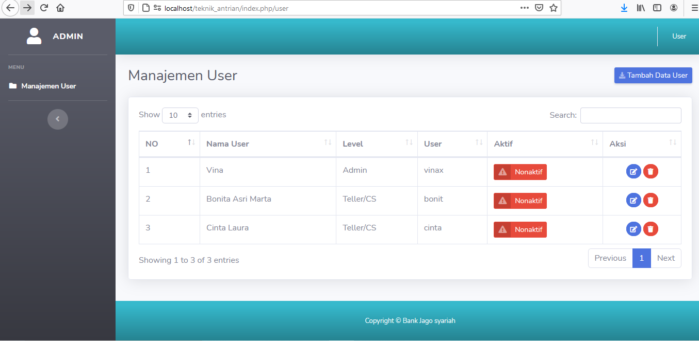
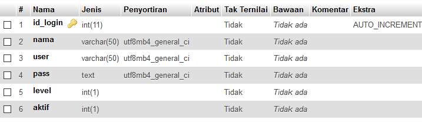

# Manajemen User

Lanjutan Pratikum kali ini kita akan membuat program yang dapat mengatur user dalam sistem, dalam hal ini yang dapat melakukan pengaturan hanya admin saja, akan tetapi karena kita belum membahas program login maka belum dapat mengatur hak akses untuk masing-masing user, maka  hasil dari program kita sementara ini masih dapat dibuka siapa saja. 

## Langkah 1: Rancang Tabel
Buat tabel pada database dengan nama `user` dengan struktur seperti dibawah ini:<br>


## Langkah 2: Rancang Tampilan (UI)
Untuk membuat program kita tersusun dengan rapi maka semua file program yang terdapat pada administrator kita simpan dalam folder yang terpisah, program ini akan disimpan dalam folder `user` yang diletakan dalam folder `view` sehingga `view\user`. Tampilan program merupakan modifikasi dari program SB2Admin yang sudah pernah kita pergunakan sebelunya. Terdapat 5 File dalam folder`user` ini: 
1. header.php
2. footer.php
3. user.php
4. tambah.php
5. edit.php

### header.php
```php
<!DOCTYPE html>
<html lang="en">

<head>

    <meta charset="utf-8">
    <meta http-equiv="X-UA-Compatible" content="IE=edge">
    <meta name="viewport" content="width=device-width, initial-scale=1, shrink-to-fit=no">
    <meta name="description" content="">
    <meta name="author" content="">

    <title>Teknik Antrian</title>

    <!-- Custom fonts for this template-->
    <link href="<?php echo base_url('asset/'); ?>sb2_admin/vendor/fontawesome-free/css/all.min.css" rel="stylesheet" type="text/css">
    <link href="https://fonts.googleapis.com/css?family=Nunito:200,200i,300,300i,400,400i,600,600i,700,700i,800,800i,900,900i" rel="stylesheet">
    <!-- Custom styles for this template-->
    <link href="<?php echo base_url('asset/'); ?>sb2_admin/css/sb-admin-2.min.css" rel="stylesheet">
    <link href="<?php echo base_url('asset/'); ?>sb2_admin/vendor/datatables/dataTables.bootstrap4.min.css" rel="stylesheet">

</head>

<body id="page-top">
    <div id="wrapper">
        <ul class="navbar-nav bg-gradient-dark sidebar sidebar-dark" id="accordionSidebar">
            <a class="sidebar-brand d-flex align-items-center justify-content-center" href="index.html">
                <div class="sidebar-brand-icon">
                    <i class="fas fa-fw fa-user"></i>
                </div>
                <div class="sidebar-brand-text mx-3">Admin</div>
            </a>
            <hr class="sidebar-divider">
            <div class="sidebar-heading">
                Menu
            </div>
            <li class="nav-item <?php if ($page == 'user') {
                                    echo 'active';
                                }
                                ?>">
                <a class="nav-link" href="<?php echo base_url() ?>user">
                    <i class="fas fa-fw fa-folder"></i>
                    <span>Manajemen User </span></a>
            </li>
            <hr class="sidebar-divider">
            <div class="text-center d-none d-md-inline">
                <button class="rounded-circle border-0" id="sidebarToggle"></button>
            </div>
        </ul>
        <div id="content-wrapper" class="d-flex flex-column">
            <div id="content">
                <nav class="navbar navbar-expand navbar-light bg-gradient-info topbar mb-4 static-top shadow">
                    <button id="sidebarToggleTop" class="btn btn-link d-md-none rounded-circle mr-3">
                        <i class="fa fa-bars text-white"></i>
                    </button>
                    <ul class="navbar-nav ml-auto">
                        <div class="topbar-divider d-none d-sm-block"></div>
                        <li class="nav-item dropdown no-arrow">
                            <a class="nav-link dropdown-toggle" href="#" id="userDropdown" role="button" data-toggle="dropdown" aria-haspopup="true" aria-expanded="false">
                                <span class="mr-2 d-none d-lg-inline text-white small">
                                    User
                                </span> </a>
                            <div class="dropdown-menu dropdown-menu-right shadow animated--grow-in" aria-labelledby="userDropdown">
                                <a class="dropdown-item" href="<?php echo base_url() ?>user/logout">
                                    <i class="fas fa-sign-out-alt fa-sm fa-fw mr-2 text-gray-400"></i>
                                    Logout
                                </a>
                            </div>
                        </li>

                    </ul>
                </nav>
                <!-- End of Topbar -->
```
dari program header.php diatas perhatikan program dibawah ini:
```php
<li class="nav-item <?php if ($page == 'user') {
                        echo 'active';
                    }
                    ?>">
    <a class="nav-link" href="<?php echo base_url() ?>user">
        <i class="fas fa-fw fa-folder"></i>
        <span>Manajemen User </span></a>
</li>
```
`$page` adalah variabel yang dikirim dari controller untuk menentukan halaman terpilih sehingga menu dapat diberikan efek `active`

### footer.php
```php
</div>
<footer class="sticky-footer bg-gradient-info">
    <div class="container my-auto">
        <div class="copyright text-center my-auto text-white">
            <span>Copyright &copy; Bank Jago syariah</span>
        </div>
    </div>
</footer>
</div>
</div>

<!-- Scroll to Top Button-->
<a class="scroll-to-top rounded" href="#page-top">
    <i class="fas fa-angle-up"></i>
</a>

<!-- Bootstrap core JavaScript-->
<script src="<?php echo base_url('asset/'); ?>sb2_admin/vendor/jquery/jquery.min.js"></script>
<script src="<?php echo base_url('asset/'); ?>sb2_admin/vendor/bootstrap/js/bootstrap.bundle.min.js"></script>

<!-- Core plugin JavaScript-->
<script src="<?php echo base_url('asset/'); ?>sb2_admin/vendor/jquery-easing/jquery.easing.min.js"></script>

<!-- Custom scripts for all pages-->
<script src="<?php echo base_url('asset/'); ?>sb2_admin/js/sb-admin-2.min.js"></script>

<!-- Page level plugins -->
<script src="<?php echo base_url('asset/'); ?>sb2_admin/vendor/datatables/jquery.dataTables.min.js"></script>
<script src="<?php echo base_url('asset/'); ?>sb2_admin/vendor/datatables/dataTables.bootstrap4.min.js"></script>

<!-- Page level custom scripts -->
<script src="<?php echo base_url('asset/'); ?>sb2_admin/js/demo/datatables-demo.js"></script>
</body>
</html>
```
### user.php
```php
<div class="container-fluid">
    <!-- Page Heading -->
    <div class="d-sm-flex align-items-center justify-content-between mb-4">
        <h3 class="h3 mb-0 text-gray-800 d-none d-sm-inline-block ">Manajemen User</h3>
        <a href="<?php echo base_url('') ?>user/tambah_user/" class="btn btn-sm btn-primary shadow-sm"><i class="fas fa-download fa-sm text-white-50"></i> Tambah Data User</a>
    </div>
    <div class="card shadow mb-4">
        <div class="card-body">
            <div class="table-responsive">
                <table class="table table-bordered" id="dataTable" width="100%" cellspacing="0">
                    <thead>
                        <tr>
                            <th>NO</th>
                            <th>Nama User</th>
                            <th>Level</th>
                            <th>User</th>
                            <th>Aktif</th>
                            <th>Aksi</th>
                        </tr>
                    </thead>
                    <tbody>
                        <?php $no = 0;
                        foreach ($user as $usr) {
                            $no++ ?>
                            <tr>
                                <td><?php echo $no; ?></td>
                                <td><?php echo $usr['nama'] ?></td>
                                <td><?php if ($usr['level'] == 0) {
                                        echo "Belum ditentukan";
                                    } elseif ($usr['level'] == 1) {
                                        echo "Admin";
                                    } elseif ($usr['level'] == 2) {
                                        echo "Teller/CS";
                                    }
                                    ?></td>
                                <td><?php echo $usr['user'] ?></td>
                                <td>
                                    <?php if ($usr['aktif'] == 1) { ?>
                                        <a href="<?php echo base_url(); ?>user/aktif/<?php echo $usr['id_login'] ?>/<?php echo $usr['aktif'] ?>" class="btn btn-success btn-icon-split btn-sm">
                                            <span class="icon text-white-50">
                                                <i class="fas fa-check"></i>
                                            </span>
                                            <span class="text">Aktif</span>
                                        <?php } else { ?>
                                        </a>
                                        <a href="<?php echo base_url(); ?>user/aktif/<?php echo $usr['id_login'] ?>/<?php echo $usr['aktif'] ?>" class="btn btn-danger btn-icon-split btn-sm">
                                            <span class="icon text-white-50">
                                                <i class="fas fa-exclamation-triangle"></i>
                                            </span>
                                            <span class="text">Nonaktif</span>
                                        </a>
                                    <?php } ?>
                                </td>
                                <td align="center">
                                    <a href="<?php echo base_url(); ?>user/edit/<?php echo $usr['id_login'] ?>" class="btn btn-primary btn-circle btn-sm" title="Edit">
                                        <i class="fas fa-edit"></i>
                                    </a>
                                    <a href="<?php echo base_url(); ?>user/hapus/<?php echo $usr['id_login'] ?>" class="btn btn-danger btn-circle btn-sm" title="Hapus">
                                        <i class="fas fa-trash"></i>
                                    </a>
                                </td>
                            </tr>
                        <?php } ?>
                    </tbody>
                </table>
            </div>
        </div>
    </div>
</div>
```
### tambah.php
```php

```
### edit.php
```php

```

Whenever you commit to this repository, GitHub Pages will run [Jekyll](https://jekyllrb.com/) to rebuild the pages in your site, from the content in your Markdown files.

### Markdown

Markdown is a lightweight and easy-to-use syntax for styling your writing. It includes conventions for

```markdown
Syntax highlighted code block

# Header 1
## Header 2
### Header 3

- Bulleted
- List

1. Numbered
2. List

**Bold** and _Italic_ and `Code` text

[Link](url) and 
```

For more details see [GitHub Flavored Markdown](https://guides.github.com/features/mastering-markdown/).

### Jekyll Themes

Your Pages site will use the layout and styles from the Jekyll theme you have selected in your [repository settings](https://github.com/gunturs/Silmulation-Manajemen-User/settings/pages). The name of this theme is saved in the Jekyll `_config.yml` configuration file.

### Support or Contact

Having trouble with Pages? Check out our [documentation](https://docs.github.com/categories/github-pages-basics/) or [contact support](https://support.github.com/contact) and we’ll help you sort it out.
